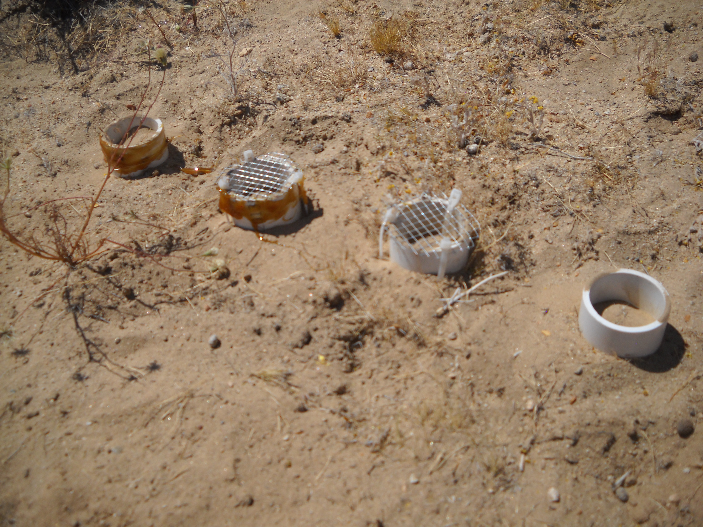

```{r setup, include=FALSE}
knitr::opts_chunk$set(echo = TRUE)
```

## Practicing statistics with Tom and making it into a webpage


``` {r}
## load the cars dataset
data <- cars
str(cars)

cor(cars$speed,cars$dist)


```